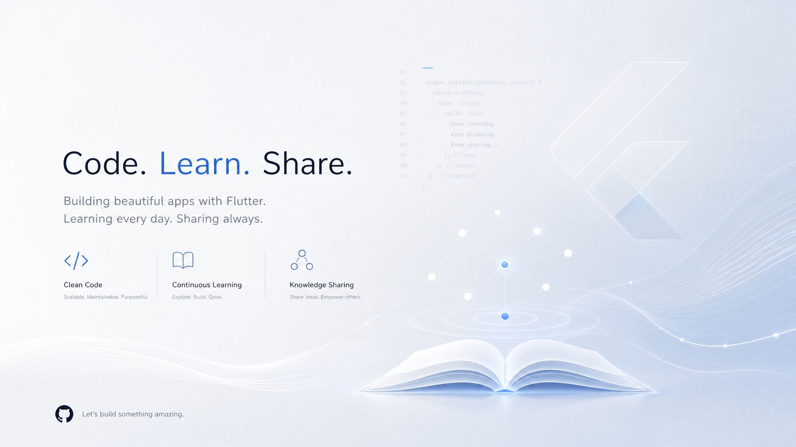

# Tarek Hayan

  
">

### Flutter Developer | Continuous Learner | Knowledge Sharer

---

## 👋 Hello  World!

I'm Tarek, a Flutter Developer from Egypt. I love building applications that are simple, scalable, maintainable, and enjoyable to use. I believe programming is more than writing code; it is about solving problems, understanding systems, and continuously learning.

---

## ✨ Featured Projects

Here are some projects that best represent my work and passion for building clean Flutter applications:

### [Movie-App](https://github.com/TarekHayan/Movie-App)
🎬 iFox — A modern movie discovery experience built with Flutter and TMDB. This project demonstrates my ability to integrate external APIs, manage state effectively, and create a smooth user experience.

### [Doc-Doc-App](https://github.com/TarekHayan/Doc-Doc-App)
🏥 Doc-Doc — A professional healthcare management and appointment booking platform. This project showcases my skills in developing complex UIs and handling secure authentication flows.

### [News-App](https://github.com/TarekHayan/News-App)
📰 News — A minimal global news aggregator built with Flutter. This application highlights my proficiency in consuming news APIs and ensuring a responsive layout across devices.

---

## 📚 Currently Exploring

My journey as a developer is fueled by an insatiable curiosity. I'm always diving into new concepts and refining my understanding of core principles. Currently, I'm deeply exploring advanced **Flutter** techniques, delving into **Software Architecture** patterns, and mastering **Design Patterns**. I'm also sharpening my skills in **Git**, **Testing**, **Performance Optimization**, and **Data Structures & Algorithms**.

---

## 📝 Flutter Notes

**Flutter Notes** is my personal initiative to document my continuous learning journey. It's a space where I distill complex topics, share insights, and build a knowledge base for myself and the community. This project embodies my belief in the importance of sharing knowledge and fostering a culture of continuous learning.

---

## 📊 GitHub Stats

  
  
  

---

## 🔗 Connect

*   **GitHub**: [TarekHayan](https://github.com/TarekHaya)
*   **LinkedIn**: [Tarek Hayan](www.linkedin.com/in/tarek-hayan-5633b2399)
*   **Email**: tarekhayan77@gmail.com

  

### Flutter Developer | Continuous Learner | Knowledge Sharer
