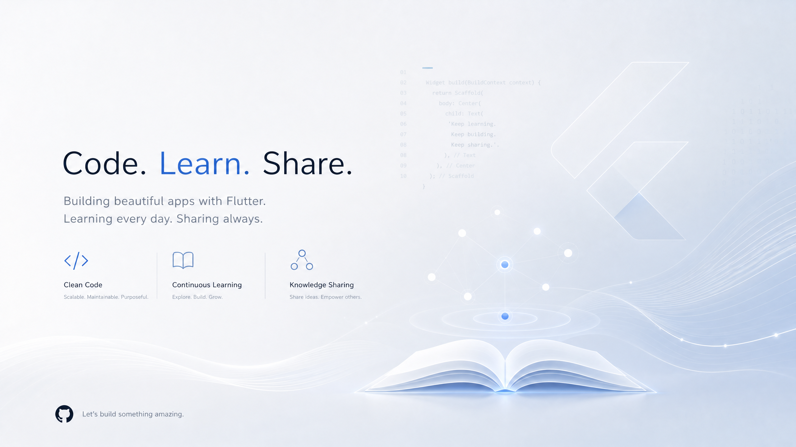

  

<h1 align="center">Tarek Hayan</h1>

  <strong>Flutter Developer · Software Architecture · AI / RAG</strong>

  I build maintainable cross-platform applications and explore the engineering principles behind reliable software.

---

## 👋 Hello World!

I'm Tarek, a Flutter Developer from Egypt focused on building **clean, scalable, and maintainable software**.

My current focus is growing beyond simply building screens: I care about **architecture, separation of concerns, testing, API integration, state management, and thoughtful engineering decisions**.

I also explore **AI and Retrieval-Augmented Generation (RAG)**, with a focus on understanding how reliable retrieval and evidence-based systems are designed.

---

## 🚀 Featured Projects

### 🧠 [Zekra](https://github.com/TarekHayan/Zekra_project)
A cross-platform personal productivity application being built with an architecture-first approach.

**Focus:** Flutter · Clean Architecture · Feature-first structure · Offline-first design · Arabic RTL · Cross-platform

> 🚧 Currently in the foundation and planning phase.

### 🤖 [Physiotherapist-RAG](https://github.com/TarekHayan/Physiotherapist-RAG)
A medical Retrieval-Augmented Generation pipeline for clinical and physiotherapy practice guidelines.

**Focus:** Python · RAG · Semantic Chunking · Embeddings · ChromaDB · Retrieval · Cross-Encoder Reranking · Gemini · Evaluation

### 🏥 [Doc-Doc-App](https://github.com/TarekHayan/Doc-Doc-App)
A Flutter healthcare application focused on appointment and healthcare workflows.

**Focus:** Flutter · BLoC/Cubit · Dio · Retrofit · Freezed · GetIt · Firebase · Responsive UI

### 🎬 [Movie-App](https://github.com/TarekHayan/Movie-App)
A movie discovery application powered by TMDB, featuring authentication, search, favorites, trailers, and responsive layouts.

**Focus:** Flutter · BLoC/Cubit · REST APIs · Firebase · Firestore · Responsive UI

---

## 🛠️ Tech Stack

**Mobile & Cross-platform**

`Flutter` `Dart` `Android` `Web` `Desktop`

**Architecture & Engineering**

`Clean Architecture` `Feature-first Architecture` `SOLID` `Design Patterns` `Separation of Concerns` `Git`

**Flutter Ecosystem**

`BLoC/Cubit` `Dio` `Retrofit` `Freezed` `GetIt` `Firebase` `Firestore`

**AI / Data**

`Python` `RAG` `Embeddings` `ChromaDB` `Semantic Search` `Cross-Encoder Reranking`

---

## 📚 Currently Learning

- Advanced **Flutter Architecture** and maintainable application design
- **Software Architecture** and architectural decision-making
- **Testing** and software quality practices
- **Data Structures & Algorithms** and problem-solving
- **AI / RAG** systems and retrieval evaluation
- **Git & GitHub** workflows and professional engineering practices

---

## 📝 Flutter Notes

**Flutter Notes** is my personal learning initiative where I turn what I learn about Flutter, architecture, and software engineering into practical notes and educational content.

I believe that understanding **why** a solution works is more valuable than simply knowing **how** to write it.

---

## 🎯 Engineering Philosophy

> Build simply. Understand deeply. Improve continuously.

I prefer clear responsibilities, readable code, focused changes, and architecture that solves real problems without unnecessary complexity.

---

  

  <strong>Keep Learning. Keep Building.</strong>

